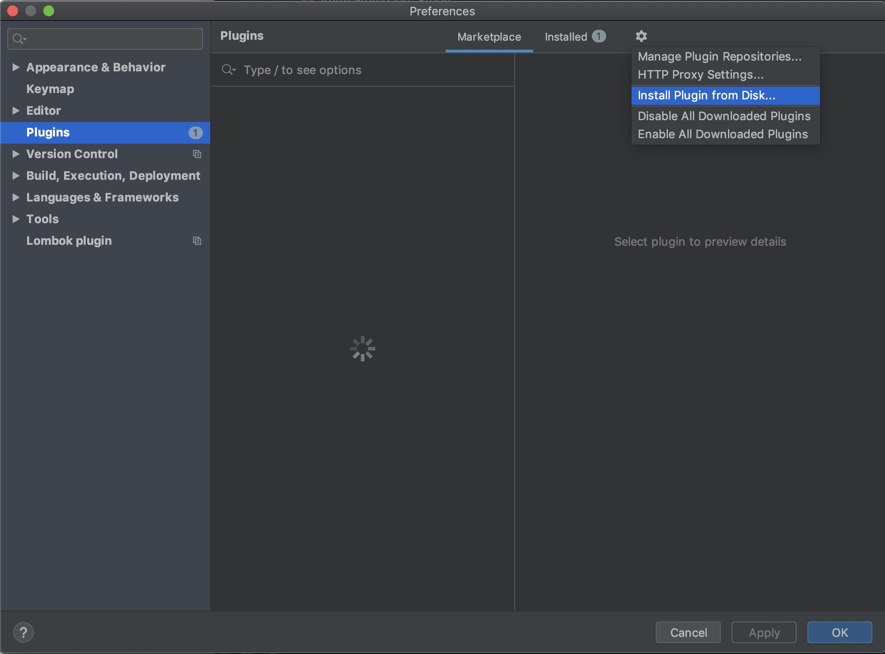
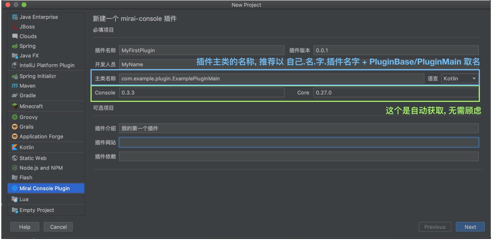
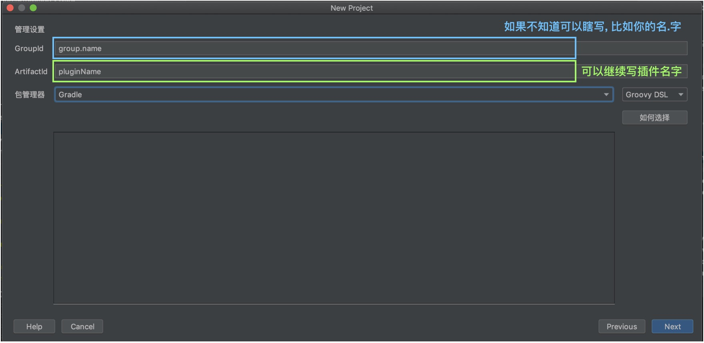
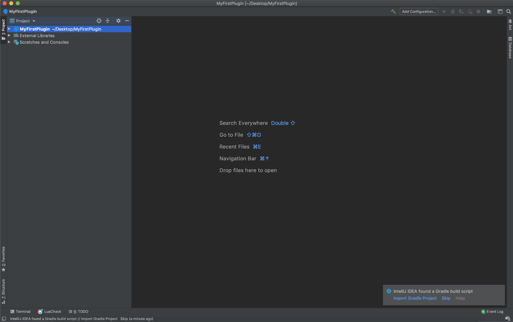
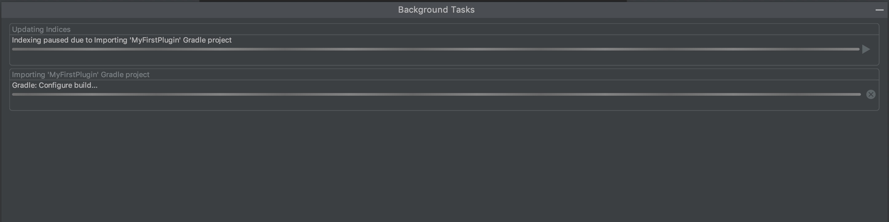
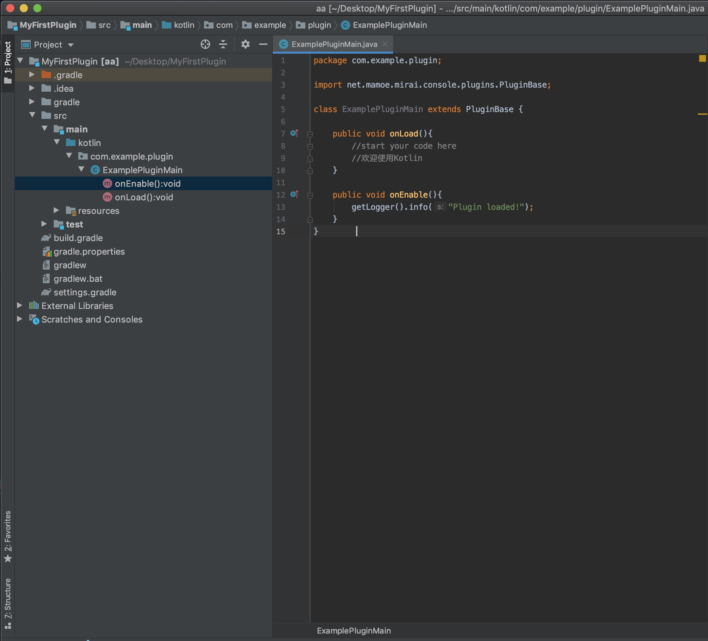
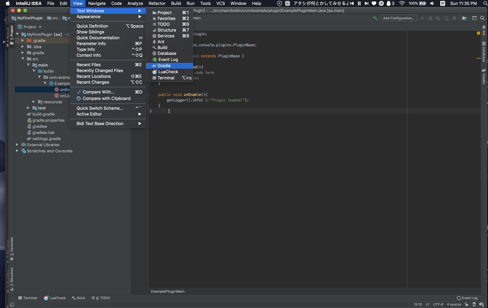
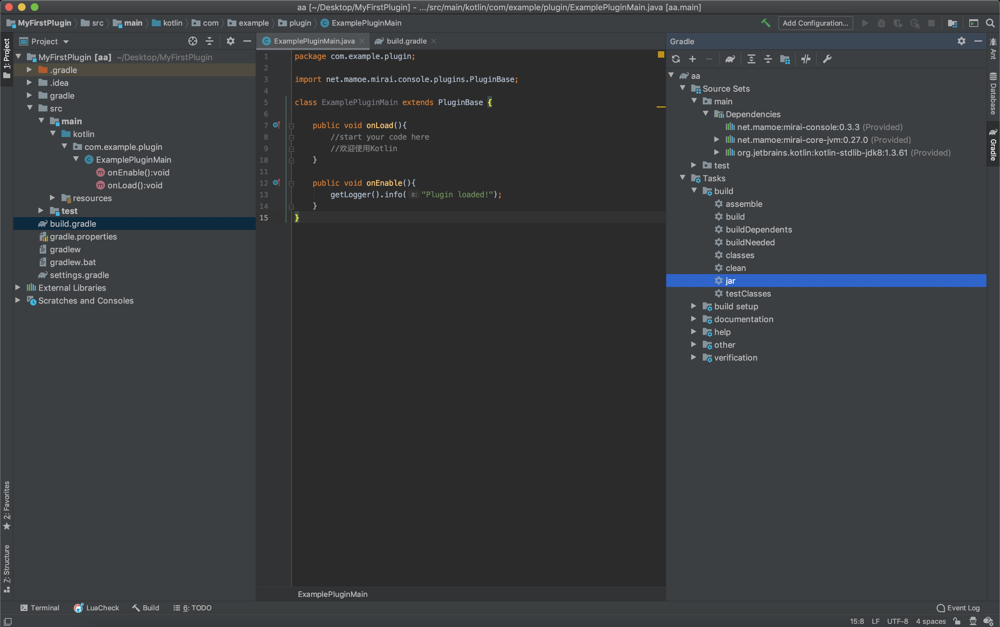
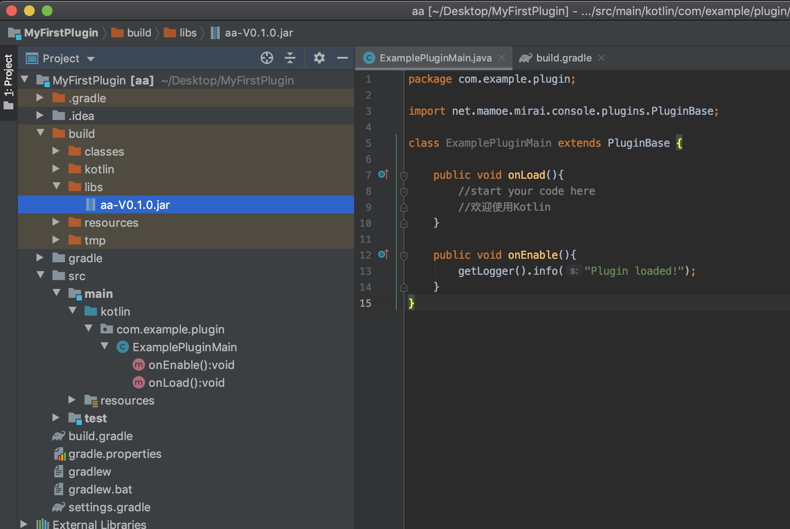

# 如何开发Mirai-console插件


#### 
首先, 你需要一些基础的编程知识<br> 
开发插件的下限很低, 仅仅了解开发用的语言即可<br>
当然, 插件开发的上限也很高, Mirai-Console的插件的控制层下至简单的回复逻辑, 上至修改与QQ通讯的协议<br>
目前, Java与Kotlin均可用来开发, 仅需了解任意一门语言, 都可以进行插件开发<br>

### 我没有学习过任何与编程相关的知识或我没有学过这两种语言
你有两个选择，学习Java或者Kotlin<br> 
学习Java/Kotlin的好处: 学习速度相对较快, 学习资料多<br> 
学习Kotlin的好处: mirai源开发语言为kotlin, 学习了kotlin可以顺便读懂mirai及其分支项目, 更容易写出更高质量的插件<br> 

方法1: 认真读书<br> 
[30分钟精通JAVA](https://www.runoob.com/java/java-tutorial.html) 最低只需要学完Java 教程, Java 面向对象两章<br> 
[30分钟精通Kotlin](https://www.kotlincn.net/docs/reference/) 最低只需要学完类与对象<br> 

方法2: 通过例子边学插件边学语言<br> 
需要较高悟性, 不推荐完全没有接触编程的人尝试<br> 
## 我需要什么?
### Java环境
JDK是Java语言的软件开发工具包，开发Java软件时必须安装jdk。<br>
推荐安装JDK 11, 最低推荐使用JDK 8来开发Mirai-Console插件。<br> 


打开控制台（windows按徽标键+R，在弹出的窗口输入cmd然后回车；linux直接打开控制台），输入以下代码并回车：
```$xslt
javac -version
```
返回的应该类似于以下的结果：
```$xslt
javac 1.8.0_60-ea
```
如果类似于以上的结果，恭喜你已经成功的安装了jdk 8并且不希望更新版本可以跳过这个步骤的教程。<br> 
如果返回的版本是1.7.0或者更旧的版本，或者返回的类似于“'javac' 不是内部或外部命令，也不是可运行的程序或批处理文件”，说明你还没有安装最新版本的jdk。<br> 

#### 安装最新版JDK
请打开以下链接下载JDK, 推荐使用稳定的11：https://www.oracle.com/java/technologies/javase-downloads.html<br> 
安装过程因系统而异，这里就不详细讲解了。<br> 
另外，jdk安装包也包含相应版本的jre，所以你无需在java官网上再下载安装一次jre。<br> 
在windows系统安装jdk后，你需要配置jdk来保证命令行正常使用。<br> 
#### windows系统中旧版JDK的配置
大部分JDK在安装时已经可以自己配置, 请直接检查是否成功, 如不成功在阅读本块<br> 
检查是否配置成功: 点击windows徽标键+R，输入cmd并回车，在打开的控制台输入“javac -version”和“java -version”，如果都能正确的返回版本信息，说明配置环境变量成功了。至此，你的jdk已经安装并配置完成<br> 
如果没有, 以下只写了简单流程, 如需要图文帮助可以搜索"windows系统中JDK的配置"<br> 
- 右键“计算机”，点击“属性”，<br> 
- 在弹出的窗口中点击“高级系统设置”，“环境变量”，<br> 
- 点击“系统变量”下面的“新建”，在弹出的窗口的“变量名”输入“JAVA_HOME”（不带引号），“变量值”输入你之前安装jdk的安装路径，我的是“C:\Program Files\Java\jdk1.8.0_60”（不带引号），这里根据你安装jdk的路径来输入。然后点击确定<br> 
- 在“系统变量”中寻找“Path”（不带引号）变量，选中后点击“编辑”，在“变量值”的最后面（注意不是把整个替换，是添加在最后面）输入：
```$xslt
%JAVA_HOME%\bin;%JAVA_HOME%\jre\bin;
```
这里要注意原来Path的变量值末尾有没有;号，如果没有，先输入;号再输入上面的代码。<br> 
点击“系统变量”下面的“新建”，在弹出的窗口的“变量名”输入“CLASSPATH”（不带引号），“变量值”输入以下的字符串（注意，最前面有一个点“.”不要忘了）：
```$xslt
.;%JAVA_HOME%\lib;%JAVA_HOME%\lib\tools.jar
```
- 检查是否配置成功。
#### IDE
IDE，即集成开发环境，是辅助编程开发的软件。使用合适的IDE能有效地减少代码语法错误、编译麻烦等问题，加大开发效率。目前java开发者常用的IDE有Eclipse，NetBeans，IntelliJ IDEA等软件。我这里使用IntelliJ IDEA 14.1（以下简称“IDEA”）与windows 7系统为例子，来讲IDE的安装和配置。<br>
强烈推荐IDEA， IDEA可以使用idea插件[mirai-console-intellij](https://github.com/mamoe/mirai-console-intellij)快速进行插件开发
<br>
打开[IntelliJ IDEA的官方网站]( http://www.jetbrains.com/idea/)，点击“Get IntelliJ IDEA now”
<br>
IDEA分付费的Ultimate版和免费的Community版，选择自己的系统后，根据自己的需求点击下载使用，一般的使用免费的Community版就足够了。
<br>

### 我要如何开始
**此处使用IDEA作为演示IDE**<br>
新手只推荐使用IDEA, 如执着于不使用idea, 可以阅读[PluginStructure](PluginStructure.MD)手动构建插件环境<br>

#### IDE准备
安装idea插件[mirai-console-intellij](https://github.com/mamoe/mirai-console-intellij), 这是一个用于快速创建Mirai Console插件的IDE插件 <br>
1: 自动安装<br>
打开IDEA, 点击Preferences或按[Ctrl+Alt+Shift+S]/[Cmd+Alt+Shift+S], 点击插件[Plugins], 市场[Market place], 搜索Mirai, 安装Mirai-Console<br>
预计2020/3/11号后才可以在market里搜索到<br>
<br>

2: 手动安装<br>
前往[这里](https://github.com/mamoe/mirai-console-intellij/releases)下载最新的插件[.jar]<BR>
打开IDEA, 点击Preferences或按[Ctrl+Alt+Shift+S]/[Cmd+Alt+Shift+S], 按下图操作, 选择下载的jar 然后重启IDE<br>


<br>

#### 启动项目
1： 点击New Project<br>
2： 在左侧选择Mirai Console Plugin<br>
3： 根据下图辅助填写信息<br>
<br>
4:  点击[next]<br>
5:  根据下图辅助继续填写信息<br>
<br>
6:  点击[next]<br>
7:  最后一页与本地储存位置有关, 如不懂使用默认即可<br>
8:  点击[Finish]稍作等待<br>
9:  等待这个页面加载出来<br>
<br>
10: 点击右下↘的Import gradle project或Import Maven Project<br>
11: 等待进度条结束<br>
<br>
12: 等待这个页面加载出来(这是第一页选的Java语言, kotlin类似)<br>
<br>
13: 插件环境正式完成<br>


<br>
<br>
<br>

#### 如何打包插件
1: 根据下图帮助打开gradle window[maven同理]<br>
<br>
2: 根据下图帮助点击JAR<br>
<br>
3: 在这里找到成品, 完成<br>
<br>

PS: 如果要打包有依赖lib的插件, 请继续向后读<br>

    
## 下一步

Java  玩家->[我的第一个插件](https://github.com/mamoe/mirai-console/blob/master/PluginDocs/java/)
Kotlin玩家->[我的第一个插件](https://github.com/mamoe/mirai-console/blob/master/PluginDocs/kotlin/)


<i>本章部分章节引用自[搭建环境 - Nukkit插件从0开始](https://www.cnblogs.com/xtypr/p/nukkit_plugin_start_from_0_build_environment.html),</i>


