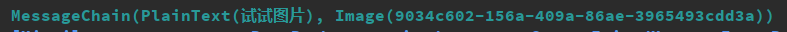

# Mirai

一个以<b>TIM QQ协议(非web)</b>驱动的JAVA(+Kotlin) QQ机器人服务端核心  
我们坚持免费与开源  
  
项目处于快速开发阶段  
部分协议来自网络上开源项目  
一切开发旨在学习, 请勿用于非法用途

<br>

A JAVA(+Kotlin) powered open-source project under GPL license<br>
It use protocols from <i>TIM QQ</i>, that is, it won't be affected by the close of <i>Smart QQ</i><br>
The project is all for <b>learning proposes</b> and still in <b>developing stage</b><br>


## 抢先体验
现在你可以使用 Mirai 内置的一些测试qq号体验 Mirai, 但我们现在还不建议你使用自己的 qq 号登录
1. Clone
2. Import as Maven project
3. Run [MiraiMain](mirai-core/src/main/java/net/mamoe/mirai/MiraiMain.java#L7)

### 事件 Hook
#### Java:
```
MiraiEventHook.onEvent(FriendMessageEvent.class)
       .handler(a -> {
               if(a.getMessageString().equals("你好")) 
                       a.getQQ().sendMessage("你好！");
       })
       .mountAlways();
```
#### Kotlin:
```
FriendMessageEvent::class.hookAlways{
    if(it.message() valueEquals "你好")
          it.qq.sendMessage("你好！")
}
```


### 图片测试
**现在可以接受图片消息**(并解析为消息链):  
  


不过我们还正在努力做发送图片

## 代码结构
Network部分使用 Kotlin 完成(因为kt有对 unsigned byte 的支持).  
与插件相关性强(或其他在二次开发中容易接触)的部分尽量使用 Java 完成,
若使用 Kotlin, 我们会通过 Java interface 实现或 javadoc 帮助未接触过 Kotlin 的开发者.
即使你完全不了解 Kotlin, 你也可以正常开发.

# TODO
- [x] 事件(Event)模块  
- [ ] 插件(Plugin)模块  **(Working on)**
- [x] Network - Touch  
- [X] Network - Login
- [X] Network - Session  
- [X] Network - Verification Code
- [X] Network - Message Receiving  
- [X] Network - Message Sending  
- [ ] Network - Events
- [ ] Bot - Friend/group list
- [ ] Bot - Actions(joining group, adding friend, etc.)
- [ ] Message Section **(Working on)**
- [ ] Image uploading **(Working on)**
- [ ] Contact  
- [ ] UI

<br>

# 使用方法
## 要求
- Java 11 或更高
- Kotlin 1.3 或更高
## 插件开发
``` text
    to be continued
    ...
```

# Usage
## Requirements
- Java 11 or higher
- Kotlin 1.3 or higher
## Plugin Development
``` text
    to be continued
    ...
```


