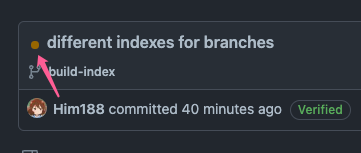

# Mirai - Using Snapshots

每个 commit 在构建成功后都会发布一个开发测试版本到 mirai 仓库。如有需要，可添加仓库并使用。开发测试版本非常不稳定，仅用于测试某 commit 对一个问题的修复情况，而不建议在生产或开发环境使用。

每个开发测试版本只保留一个月。

- [在 Maven 使用](#在-maven-使用)
- [在 Gradle 使用](#在-gradle-使用)

## 在 Maven 使用

### 1. 添加 Maven 仓库

```xml

<repositories>
    <repository>
        <id>miraisnapshots</id>
        <name>mirai snapshots</name>
        <url>https://repo.mirai.mamoe.net/snapshots</url>
    </repository>
</repositories>
```

### 2. 修改依赖版本

1. 选择需要测试的 commit, 在 GitHub 查看其构建状态, 如图所示:  
   
2. 点击 "Build / JVM" 右侧的 "Details":  
   
3. 在打开的页面中点击 "Summary", 然后在 "Annotations" 栏目中找到类似 "本 commit 的预览版本号: 2.15.0-build-index-1" 的提示, 得到开发测试版本号 `2.15.0-build-index-1`. 其中, `build-index` 为此 commit 所属分支名, `2.15.0` 意为当前分支的主版本号, `1` 为此分支下的第 1 次成功构建.
   通常在 `dev` 分支构建的预览版本号类似为 `2.15.0-dev-102`

```xml

<dependencies>
    <dependency>
        <groupId>net.mamoe</groupId>
        <artifactId>mirai-core-jvm</artifactId>
        <version>2.15.0-build-index-1</version>
    </dependency>
</dependencies>
```

## 在 Gradle 使用

### 1. 添加 Maven 仓库

build.gradle(.kts)

```
repositories {
   maven("https://repo.mirai.mamoe.net/snapshots") 
}
```

### 2. 修改依赖版本

1. 选择需要测试的 commit, 在 GitHub 查看其构建状态, 如图所示:  
   
2. 点击 "Build / JVM" 右侧的 "Details":  
   
3. 在打开的页面中点击 "Summary", 然后在 "Annotations" 栏目中找到类似 "本 commit 的预览版本号: 2.15.0-build-index-1" 的提示, 得到开发测试版本号 `2.15.0-build-index-1`. 其中, `build-index` 为此 commit 所属分支名, `2.15.0` 意为当前分支的主版本号, `1` 为此分支下的第 1 次成功构建.
   通常在 `dev` 分支构建的预览版本号类似为 `2.15.0-dev-102`

build.gradle(.kts)

```
dependencies {
    implementation("net.mamoe:mirai-core:2.15.0-build-index-1")
}
```

## 使用测试版本 Mirai Console Gradle 插件

settings.gradle(.kts)

```
pluginManagement {
    repositories {
        gradlePluginPortal()
        maven("https://repo.mirai.mamoe.net/snapshots")
    }
}
```

plugin.gradle(.kts)

```
plugins {
    // ...
    id("net.mamoe.mirai-console") version "2.15.0-build-index-1"
}
```

## 附录

### 获取 dev 分支的最新版本号

1. 访问 Mirai Build Index API: <https://build.mirai.mamoe.net/v1/mirai-core/dev/indexes/latest> 获取 "value" 的值, 例如 `127`
2. 访问 <https://github.com/mamoe/mirai/blob/dev/buildSrc/src/main/kotlin/Versions.kt> 获取由 `/*PROJECT_VERSION_START*/` 和 `/*PROJECT_VERSION_END*/` 包围的主分支版本号, 例如 `2.16.0`
3. 组合得到版本号 `2.16.0-dev-127`