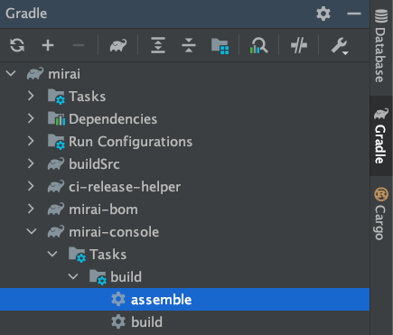

# 贡献

**感谢你来到这里和你对 mirai 做的所有贡献。**

mirai 欢迎一切形式的代码贡献。你可以通过以下几种途径向 mirai 贡献。

[mirai-core-api]: ../../mirai-core-api

[mirai-core-utils]: ../../mirai-core-utils

[mirai-core]: ../../mirai-core

[mirai-console]: ../../mirai-console/backend/mirai-console

[mirai-console-integration-test]: ../../mirai-console/backend/integration-test

[mirai-console-codegen]: ../../mirai-console/backend/codegen

[mirai-console-terminal]: ../../mirai-console/frontend/mirai-console-terminal

[mirai-conosle-compiler-annotations]: ../../mirai-console/tools/compiler-annotations

[mirai-conosle-compiler-common]: ../../mirai-console/tools/compiler-common

[mirai-conosle-intellij]: ../../mirai-console/tools/intellij-plugin

[mirai-conosle-gradle]: ../../mirai-console/tools/gradle-plugin

[mirai-bom]: ../../mirai-bom

[mirai-dokka]: ../../mirai-dokka

[mirai-core-all]: ../../mirai-core-all

[mirai-logging]: ../../logging/

[mirai-logging-log4j2]: ../../logging/mirai-logging-log4j2

[mirai-logging-slf4j]: ../../logging/mirai-logging-slf4j

[mirai-logging-slf4j-simple]: ../../logging/mirai-logging-slf4j-simple

[mirai-logging-slf4j-logback]: ../../logging/mirai-logging-slf4j-logback

# 主仓库 mirai

当前仓库 mamoe/mirai 包含 mirai 核心模块：

| 名称                     | 描述                  |
|------------------------|---------------------|
| mirai-core-utils       | 一些工具类，供其他模块使用       |
| mirai-core-api         | mirai 机器人核心 API     |
| mirai-core             | mirai 机器人核心实现       |
| mirai-core-all         | 上述三个模块的集合，用于启动器     |
| mirai-console          | 插件模式机器人框架后端         |
| mirai-console-terminal | mirai-console 的终端前端 |
| mirai-console-intellij | IntelliJ IDEA 插件    |
| mirai-console-gradle   | Gradle 插件           |
| mirai-bom              | Maven BOM           |
| mirai-logging          | 常用日志库转接器            |

## Git 分支

- `1.x`: 1.x 版本的开发 (已停止)；
- `dev`: 2.x 版本的开发（当前）；
- `-release` 后缀: 某个版本的小更新分支。如 `2.10-release` 会包含 `2.10.x` 小版本的更新。

通常请基于 `dev` 分支进行修改。
基于[版本规范](../Evolution.md#版本规范)
，若一个修改适合发布为小版本更新，我们会从 `dev` 中提取该修复到目标 `-release` 分支。

## `mirai-core` 术语

根据语境，mirai-core 有时候可能指 `mirai-core` 这个模块，有时候可能指 `mirai-core-utils`
、`mirai-core-api`、 `mirai-core` 这三个模块的整体。
本文中，`mirai-core` 将特指 `mirai-core` 模块，而用 'core' 或者 'mirai core'
指相关三个模块的整体。

## core 多平台架构

[HMPP]: https://kotlinlang.org/docs/multiplatform-discover-project.html

core 三个模块都使用 Kotlin [HMPP] 功能，同时支持 JVM 和 Native
两种平台。你可以在 [Kotlin 官方英文文档][HMPP] 了解 HMPP 模式。

core 的源集结构如图所示：

```
                     common
                       |
       /---------------+---------------\
    jvmBase                          native
    /    \                          /     \
  jvm   android                  unix      \
                                /    \     mingwX64
                               /      \
                           darwin     linuxX64
                              |
                              *
                       <darwin targets>
```

备注：

- common 包含全平台通用代码，绝大部分代码都位于 common；
- jvmBase 包含针对 JVM 平台的通用代码；
- `<darwin targets>` 为 macOS，iOS，WatchOS 等 Apple 平台目标。

## 安装 JDK

需要安装 JDK 才能编译 mirai。mirai 2.12 在如下环境测试可以编译:

- macOS 12.0.1, AdoptOpenJDK 17 aarch64
- macOS 12.0.1, Amazon Corretto 11 amd64
- Windows 10, OpenJDK 17 amd64
- Ubuntu 20.04, AdoptOpenJDK 17 amd64

若在其他环境下无法正常编译, 请尝试选择上述一个环境配置。

## 构建 JVM 目标项目

要构建只有 JVM 目标的项目（如 `mirai-console`，只需在项目根目录使用如下命令执行 Gradle 任务：

```shell
$ ./gradlew :mirai-console:assemble # 编译
$ ./gradlew :mirai-console:check # 测试
$ ./gradlew :mirai-console:build # 编译和测试
```

其中 `:mirai-console` 是目标项目的路径（path）。

你也可以在 IDEA 等有 Gradle 支持 IDE 中在通过侧边栏等方式选择项目的 `assemble` 等任务：



### 获得 mirai-console JAR

在项目根目录执行如下命令可以获得包含依赖的 mirai-console JAR。对于其他模块类似。

```shell
$ ./gradlew :mirai-console:shadowJar
```

### 构建 core

请参考 [构建 Core](BuildingCore.md)。

## 其他项目支持

- 维护社区：可以为 [mirai-console](/mirai-console)
  编写插件并发布到[论坛](https://mirai.mamoe.net/)；
- 代码优化：优化任何功能设计或实现, 或是引入一个新的设计；
- 解决问题：在 [issues](https://github.com/mamoe/mirai/issues) 查看 mirai
  正遇到的所有问题，或在 [里程碑](https://github.com/mamoe/mirai/milestones) 查看版本计划；
- 协议支持：[添加新协议支持](ImplementingProtocol.md)。

### 加入开发组

你可以随时提交 PR 解决任何问题。而若有兴趣，我们也欢迎你加入开发组，请联系 support@mamoe.net

[mirai-compose]: https://github.com/sonder-joker/mirai-compose

[plugin-center 服务端]: https://github.com/project-mirai/mirai-plugin-center

[mirai-api-http]: https://github.com/project-mirai/mirai-api-http

[project-mirai/docs]: https://github.com/project-mirai/docs

[docs.mirai.mamoe.net]: https://docs.mirai.mamoe.net

|           名称            |                                      描述                                      |
|:-----------------------:|:----------------------------------------------------------------------------:|
|   core 和 console 日常更新   |          在 milestone 安排的日常更新。我们目前版本速度是一个月到两个月发布一个次版本（2.x)。需要日常的开发。           |
|       console 后端        |                    架构稳定，现在格外需要在易用性上的提升，首先需要一个优化方案，再实现它们。                     |
|       console 文档        |                根据用户反馈，现在文档十分缺少。需要以用户的身份体验过 console 的人编写用户文档。                 |
|  图形前端 [mirai-compose]   |                各功能都缺目前尤其缺少对接 console PluginConfig 的图形化配置的实现。                 |
|   [plugin-center 服务端]   |                插件中心正在建设中。后端 Spring，前端 Vuetify。由于开发人员学业繁忙，暂搁置。                |
|    plugin-center 社区     | 插件中心计划支持所有语言的插件，因此需要与社区 SDK 作者沟通并帮助它们接入 Console 的 PluginLoader API 和插件中心的要求。 |
| plugin-center console 端 |              需要评估现在 console 架构是否足够支持插件中心及所有语言插件的管理，实现与插件中心的对接。               |
|  plugin-center gradle   |                        对接插件中心，实现通过 Task 上传插件。还没有开始做。                         |
|  mirai-console-loader   |               console 启动器。对接插件中心的 API，支持下载和更新插件等。不确定之后是否会有人实现。               |
|         IDE 插件          |            IntelliJ IDEA 的插件的工作。可以为 mirai 框架添加检查等功能。这个部分目前基本满足需求。            |
|   [mirai-api-http] v2   |                                    日常维护。                                     |
|  [project-mirai/docs]   |     用户友好文档自动部署，使用 VuePress , 部署于 [docs.mirai.mamoe.net]，目前还有部分超链接错误的问题。      |

### 里程碑

[里程碑](https://github.com/mamoe/mirai/milestones) 为各版本的开发计划.
在完成所有任务后就会发布该版本.

`Backlog` 为没有设定目标版本的计划. 如果有相关 PR, 这些计划就可能会被确定到一个最近的版本.

### 开发 mirai-core

- 使用 IntelliJ IDEA 或 Android Studio
- 安装 IDE
  插件 [kotlin-jvm-blocking-bridge](https://github.com/Him188/kotlin-jvm-blocking-bridge/blob/master/README-chs.md#%E5%AE%89%E8%A3%85-intellij-idea-%E6%88%96-android-studio-%E6%8F%92%E4%BB%B6)
- 若要添加一个 suspend 函数, 请为它添加 `@JvmBlockingBridge`,
  使用 [kotlin-jvm-blocking-bridge](https://github.com/mamoe/kotlin-jvm-blocking-bridge/blob/master/README-chs.md)
- 使用纯 Kotlin 实现
- 尽量不要引用新的库
- 遵守 Kotlin 官方代码规范（提交前使用 IDE 格式化代码即可 (commit 时勾选 'Reformat code')）
- 保证二进制兼容性: 在提交前进行 [ABI 验证](VerifyingABI.md)
- 通过 GitHub 的 Pull Request 提交代码，很快就会有相关模块负责人员来审核

如果你不太保证自己能达到上述要求也没关系，mirai 感谢你的每一行代码，维护者会审核代码并尽可能帮助你。
