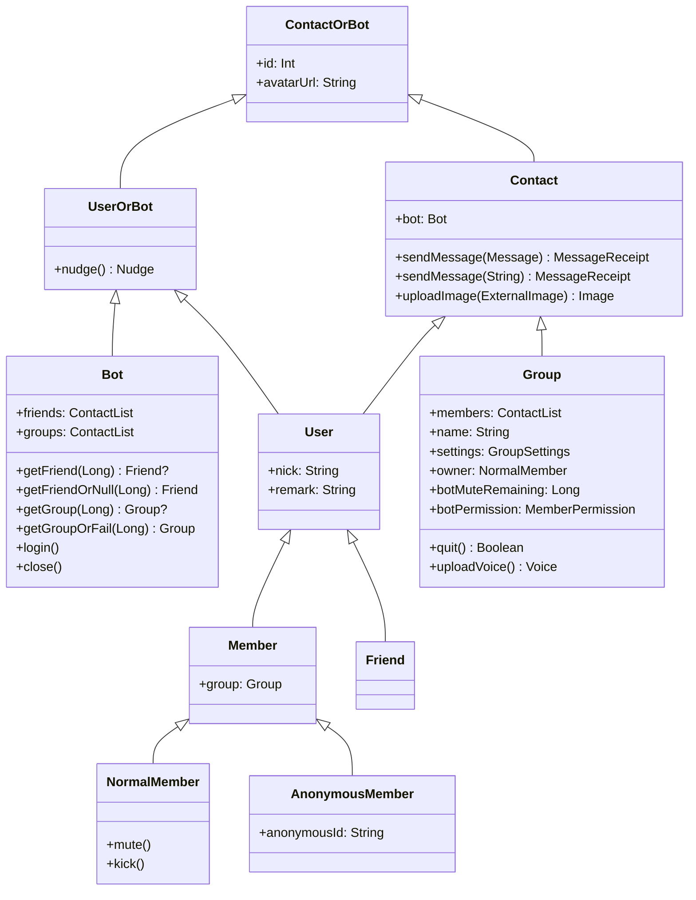

```mermaid
classDiagram

class Bot {
    +friends: ContactList
    +groups: ContactList
    +getFriend(Long) Friend?
    +getFriendOrNull(Long) Friend
    +getGroup(Long) Group?
    +getGroupOrFail(Long) Group
    +login()
    +close()
}

class ContactOrBot {
    +id: Int
    +avatarUrl: String
}

class UserOrBot {
    +nudge() Nudge
}

class Contact {
    +bot: Bot
    +sendMessage(Message) MessageReceipt
    +sendMessage(String) MessageReceipt
    +uploadImage(ExternalImage) Image
}

class User {
    +nick: String
    +remark: String
}

class Group {
    +members: ContactList
    +name: String
    +settings: GroupSettings
    +owner: NormalMember
    +botMuteRemaining: Long
    +botPermission: MemberPermission
    +quit() Boolean
    +uploadVoice() Voice
}

class NormalMember {
    +mute()
    +kick()
}

class AnonymousMember {
    +anonymousId: String
}

class Member {
    +group: Group
}

ContactOrBot<|--Contact
ContactOrBot<|--UserOrBot

UserOrBot<|--Bot
UserOrBot<|--User

Contact<|--User
Contact<|--Group

User<|--Member
User<|--Friend

Member<|--NormalMember
Member<|--AnonymousMember
```