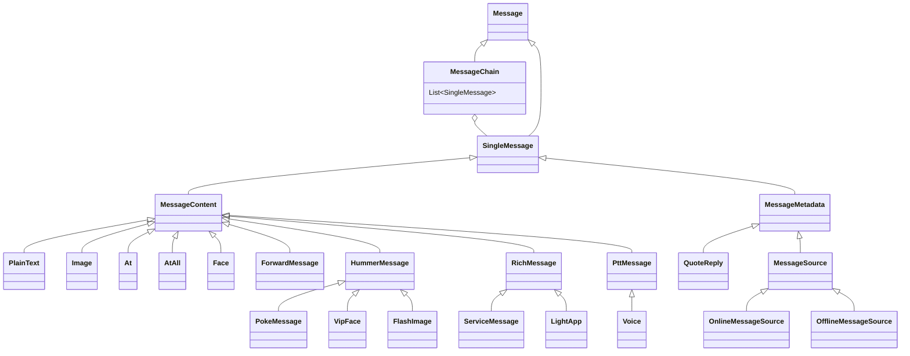

```mermaid
classDiagram

class MessageChain
MessageChain : List~SingleMessage~

Message<|--MessageChain
Message<|--SingleMessage

MessageChain o-- SingleMessage

SingleMessage<|--MessageContent
SingleMessage<|--MessageMetadata


%%%


MessageMetadata<|--QuoteReply
MessageMetadata<|--MessageSource


%%

MessageSource<|--OnlineMessageSource
MessageSource<|--OfflineMessageSource

MessageContent<|--PlainText
MessageContent<|--Image
MessageContent<|--At
MessageContent<|--AtAll
MessageContent<|--Face
MessageContent<|--ForwardMessage

MessageContent<|--HummerMessage
HummerMessage<|--PokeMessage
HummerMessage<|--VipFace
HummerMessage<|--FlashImage

MessageContent<|--RichMessage
RichMessage<|--ServiceMessage
RichMessage<|--LightApp


MessageContent<|--PttMessage
PttMessage<|--Voice
```