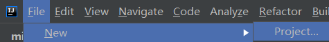
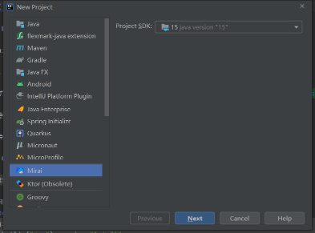

# Mirai Console - Configuring Projects

配置 Mirai Console 项目。

## 模块说明

Mirai Console 分前后端模块实现。开发插件**只需要针对同一个后端开发**，便可以运行在所有前端。

现有的前端如下所示。你不需要下载它们，因为插件的开发都是通用的。

- `mirai-console-terminal`: JVM 终端前端，适合在测试环境或服务器运行。
- [`MiraiAndroid`](https://github.com/mzdluo123/MiraiAndroid): Android 应用前端，可兼容大部分 Mirai Console 插件。
- [`mirai-compose`](https://github.com/sonder-joker/mirai-compose): 跨平台桌面图形前端，拥有可视化管理。正处于测试阶段。

## 选择版本

`mirai-console` 与 `mirai-core` **同步版本**
发布。版本号见 [mirai](/docs/ConfiguringProjects.md#%E9%80%89%E6%8B%A9%E7%89%88%E6%9C%AC)
。

通常使用最新版本的稳定版本即可。

## 配置项目

请选择以下四种方法之一。不推荐使用 Maven 构建 Mirai Console 插件。

### A.使用项目创建工具

Mirai 为 IntelliJ IDEA 或 Android Studio
提供插件: [安装方法](/docs/Preparations.md#%E5%AE%89%E8%A3%85-ide-%E6%8F%92%E4%BB%B6)

之后便可在新建项目时选择 `Mirai`
，将会自动套用 [模板项目](https://github.com/project-mirai/mirai-console-plugin-template)。





> 现在你已经配置好了项目，开始阅读 [Core 开发文档](/docs/CoreAPI.md) 或 [Console 开发文档](README.md#mirai-console)

### B.使用模板项目

Mirai 鼓励插件开发者将自己的作品开源，并为此提供了模板项目。

注意，模板项目依赖的版本号不一定是最新的。请自行替换。

1. 访问 [mirai-console-plugin-template](https://github.com/project-mirai/mirai-console-plugin-template)

2. 点击绿色按钮 "Use this template"，创建项目

3. 克隆项目，检查并修改生成的属性

> 现在你已经配置好了项目，开始阅读 [Core 开发文档](/docs/CoreAPI.md) 或 [Console 开发文档](README.md#mirai-console)

### C.使用 Gradle 插件配置项目

`VERSION`: [选择版本](#选择版本)

若使用 `build.gradle.kts`:
```kotlin
plugins {
    kotlin("jvm") version "1.5.10"
    kotlin("plugin.serialization") version "1.5.10"
    
    id("net.mamoe.mirai-console") version "VERSION"
}
```

若使用 `build.gradle`:
```groovy
plugins {
    id 'org.jetbrains.kotlin.jvm' version '1.5.10'
    id 'org.jetbrains.kotlin.plugin.serialization' version '1.5.10'
    
    id 'net.mamoe.mirai-console' version 'VERSION'
}
```

完成。Mirai Console Gradle 插件会为你配置依赖等所有编译环境。

可以在 [README](../tools/gradle-plugin/README.md#mirai-console-gradle-plugin) 获取详细的 Gradle 插件使用方法。

> 现在你已经配置好了项目，开始阅读 [Core 开发文档](/docs/CoreAPI.md) 或 [Console 开发文档](README.md#mirai-console)

### D.手动配置项目

不推荐这种方式，因为通常还需要配置一些不容易配置的编译器参数。

添加依赖：

`build.gradle.kts` 或 `build.gradle`：
```kotlin
dependencies {
  compileOnly("net.mamoe:mirai-core:$CORE_VERSION") // mirai-core 的 API
  compileOnly("net.mamoe:mirai-console:$CONSOLE_VERSION") // 后端
  
  testImplementation("net.mamoe:mirai-console-terminal:$CONSOLE_VERSION") // 前端, 用于启动测试
}
```

注意，在打包插件时必须将依赖一并打包进插件 JAR，且排除 `mirai-core`，`mirai-console` 和[它们的间接依赖](https://mvnrepository.com/artifact/net.mamoe/mirai-core-jvm/2.4.0)，否则可能导致兼容性问题。

> 现在你已经配置好了项目，开始阅读 [Core 开发文档](/docs/CoreAPI.md) 或 [Console 开发文档](README.md#mirai-console)
