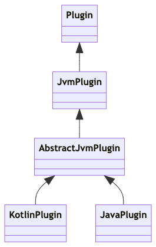
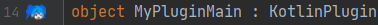
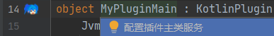
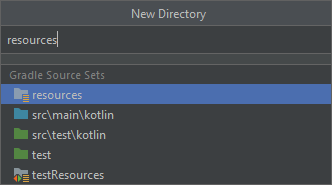
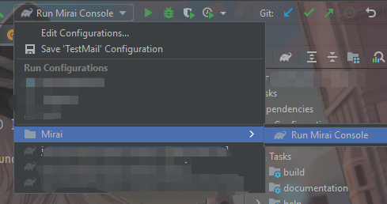
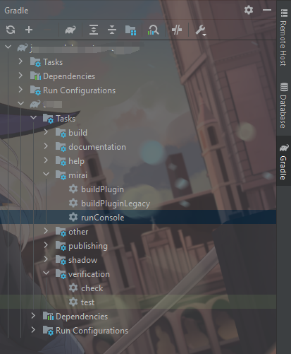
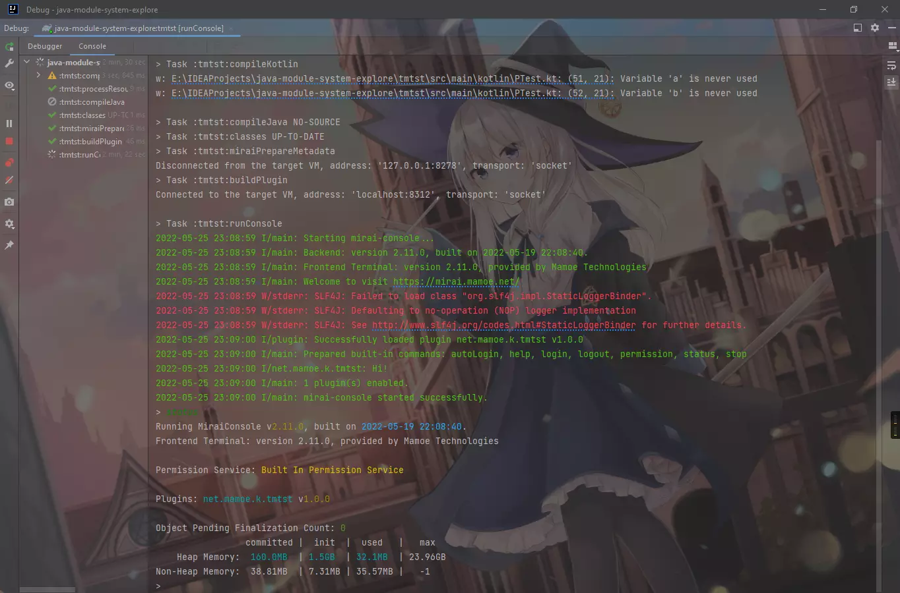

# Mirai Console Backend - JVM Plugins

[`Plugin`]: ../../backend/mirai-console/src/plugin/Plugin.kt

[`PluginDescription`]: ../../backend/mirai-console/src/plugin/description/PluginDescription.kt

[`PluginLoader`]: ../../backend/mirai-console/src/plugin/loader/PluginLoader.kt

[`PluginManager`]: ../../backend/mirai-console/src/plugin/PluginManager.kt

[`JvmPluginLoader`]: ../../backend/mirai-console/src/plugin/jvm/JvmPluginLoader.kt

[`JvmPlugin`]: ../../backend/mirai-console/src/plugin/jvm/JvmPlugin.kt

[`JvmPluginDescription`]: ../../backend/mirai-console/src/plugin/jvm/JvmPluginDescription.kt

[`AbstractJvmPlugin`]: ../../backend/mirai-console/src/plugin/jvm/AbstractJvmPlugin.kt

[`KotlinPlugin`]: ../../backend/mirai-console/src/plugin/jvm/KotlinPlugin.kt

[`JavaPlugin`]: ../../backend/mirai-console/src/plugin/jvm/JavaPlugin.kt


[`PluginData`]: ../../backend/mirai-console/src/data/PluginData.kt

[`PluginConfig`]: ../../backend/mirai-console/src/data/PluginConfig.kt

[`PluginDataStorage`]: ../../backend/mirai-console/src/data/PluginDataStorage.kt

[`ExportManager`]: ../../backend/mirai-console/src/plugin/jvm/ExportManager.kt

[`MiraiConsole`]: ../../backend/mirai-console/src/MiraiConsole.kt

[`MiraiConsoleImplementation`]: ../../backend/mirai-console/src/MiraiConsoleImplementation.kt
<!--[MiraiConsoleFrontEnd]: ../../backend/mirai-console/src/MiraiConsoleFrontEnd.kt-->

[`Command`]: ../../backend/mirai-console/src/command/Command.kt

[`CompositeCommand`]: ../../backend/mirai-console/src/command/CompositeCommand.kt

[`SimpleCommand`]: ../../backend/mirai-console/src/command/SimpleCommand.kt

[`RawCommand`]: ../../backend/mirai-console/src/command/RawCommand.kt

[`CommandManager`]: ../../backend/mirai-console/src/command/CommandManager.kt

[`Annotations`]: ../../backend/mirai-console/src/util/Annotations.kt

[`ConsoleInput`]: ../../backend/mirai-console/src/util/ConsoleInput.kt

[`JavaPluginScheduler`]: ../../backend/mirai-console/src/plugin/jvm/JavaPluginScheduler.kt

[`ResourceContainer`]: ../../backend/mirai-console/src/plugin/ResourceContainer.kt

[`PluginFileExtensions`]: ../../backend/mirai-console/src/plugin/PluginFileExtensions.kt

[`AutoSavePluginDataHolder`]: ../../backend/mirai-console/src/data/PluginDataHolder.kt

[MiraiLogger]: ../../../mirai-core-api/src/commonMain/kotlin/utils/MiraiLogger.kt

[Kotlin]: https://www.kotlincn.net/

[Java]: https://www.java.com/zh_CN/

[JVM]: https://zh.wikipedia.org/zh-cn/Java%E8%99%9A%E6%8B%9F%E6%9C%BA

[JAR]: https://zh.wikipedia.org/zh-cn/JAR_(%E6%96%87%E4%BB%B6%E6%A0%BC%E5%BC%8F)

[为什么不支持热加载和卸载插件？]: ../QA.md#为什么不支持热加载和卸载插件

[使用 AutoService]: ../QA.md#使用-autoservice

[MCI]: ../../tools/intellij-plugin/

[MiraiPixel]: ../../tools/intellij-plugin/resources/icons/pluginMainDeclaration.png

本章节介绍 JVM 平台的插件。

## JVM 平台插件接口 - [`JvmPlugin`]

所有的 JVM 插件（特别地，打包为 `JAR` 的）都必须实现 [`JvmPlugin`]，否则不会被 [`JvmPluginLoader`]
识别和加载。

[`JvmPlugin`] 派生为 [`KotlinPlugin`] 和 [`JavaPlugin`]，其关系图如下所示。



其中 `AbstractJvmPlugin` 是 Console 提供的基础实现，如数据目录等。

## 主类

JVM 平台插件的主类应被实现为一个单例（Kotlin `object`，Java 静态初始化的类，详见下文示例）。

**Kotlin 使用者的插件主类应继承 [`KotlinPlugin`]。**  
**其他 JVM 语言（如 Java）使用者的插件主类应继承 [`JavaPlugin`]。**

### 定义主类

Mirai Console 使用类似 Java `ServiceLoader` 但更灵活的机制加载插件。

一个正确的主类定义可以是以下三种任一。注意 "描述" 将会在[下文](#描述)解释。

1. Kotlin `object`

```kotlin
object A : KotlinPlugin( /* 描述 */)
```

2. Java 静态初始化单例 `class`

```java
public final class A extends JavaPlugin {
    public static final A INSTANCE = new A(); // 必须 public static, 必须名为 INSTANCE

    private A() {
        super( /* 描述 */);
    }
}
```

3. Java `class`

使用这种方法时，插件实例由 Console 在合适的时机创建。

```java
public final class A extends JavaPlugin {
    public A() { // 必须公开且无参
        super( /* 描述 */);
    }
}
```

### 确认主类正确定义

在 [IDE 插件][MCI] 的帮助下，一个正确的插件主类定义的行号处会显示 Mirai 像素风格形象图：![MiraiPixel]



### 配置主类服务

#### 自动配置主类服务

[IDE 插件][MCI] 会自动检查主类服务的配置。在没有正确配置时，IDE 将会警告并为你自动配置：  


#### 手动配置主类服务

若无法使用 IntelliJ
插件，可在资源目录 `META-INF/services/net.mamoe.mirai.console.plugin.jvm.JvmPlugin`
文件内存放插件主类全名（以纯文本 UTF-8 存储，文件内容只包含一行插件主类全名或以 `#` 起始的注释）。

也可以使用各种自动化工具配置 service 信息，如使用 Google
的 [AutoService](https://github.com/google/auto/tree/master/service)
。附[在 Kotlin 使用的方法][使用 AutoService]。

> 备注：Console 虽然使用这种常用的 service 配置方式，但不使用 ServiceLoader 加载插件实例。Console
> 的加载方式更灵活。

## 描述

插件主类需要提供一份描述信息。

插件可以通过资源文件提供静态的信息，也可以通过构造器动态传递。

描述拥有如下属性：

[语义化版本 2.0.0]: https://semver.org/lang/zh-CN/

| 属性           | 可空  | 备注                          |
|--------------|-----|-----------------------------|
| id           | 否   | 唯一识别标识符，仅能包含英文字母、数字、`.`、`-` |
| version      | 否   | 版本号，见补充说明                   |
| name         | 是   | 供用户阅读的名称，可包含任意字符            |
| author       | 是   | 作者信息                        |
| dependencies | 是   | 依赖其他插件的 ID 及版本范围            |
| info         | 是   | 供用户阅读的描述信息                  |

### 有关插件版本号的补充说明

- 插件自身的版本要求遵循 [语义化版本 2.0.0](https://semver.org/lang/zh-CN/)
  规范，合格的版本例如：`1.0.0`、`1.0`、`1.0-M1`、`1.0-pre-1`；

### 有关插件依赖的说明

- 插件依赖的版本遵循 [语义化版本 2.0.0](https://semver.org/lang/zh-CN/)
  规范，同时支持 [Apache Ivy 风格表示方法](http://ant.apache.org/ivy/history/latest-milestone/settings/version-matchers.html)
  。

在定义时需使用 ID，因为 ID 是唯一的。不支持使用名称（name）。

定义必须依赖 net.mamoe.chat-command：

```yaml
dependencies:
    - "net.mamoe.chat-command"
```

定义可选依赖 net.mamoe.chat-command：

```yaml
dependencies:
    - "net.mamoe.chat-command?"
```

定义必须依赖 1.0 及以上， 2.0 （不包含）以下的 net.mamoe.chat-command 插件：

```yaml
dependencies:
    - "net.mamoe.chat-command:[1.0, 2.0)"
```

定义可选依赖 1.0 及以上， 2.0 （不包含）以下的 net.mamoe.chat-command 插件：

```yaml
dependencies:
    - "net.mamoe.chat-command:[1.0, 2.0)?"
```

插件的依赖将在下文 [依赖其他插件][#依赖其他插件] 详细说明。

### 通过资源文件提供静态信息

在资源文件目录（如 `src/main/resources`）创建 `plugin.yml`，并填写上述属性，示例：

```yaml
id: net.mamoe.chat-command
version: 0.3.0
name: Chat Command
author: Mamoe Technologies
dependencies: [ ] # 或者不写这行
info: 允许在聊天环境执行指令。
```

然后在插件主类指定从资源加载：

*Kotlin*

```kotlin
object A : KotlinPlugin(JvmPluginDescription.loadFromResource())
```

*Java*

```java
public final class JExample extends JavaPlugin {
    public static final JExample INSTANCE = new JExample();

    private JExample() {
        super(JvmPluginDescription.loadFromResource());
    }
}
```

注意，尽管 `loadFromResource` 支持读取任意路径的文件，但也建议使用默认的 `plugin.yml`
。因为目前有计划修改插件信息的读取方式，这种 `plugin.yml` 的读取方式很有可能会继续得到支持。

### 在构造器动态提供

*注意：由于目前有计划修改插件信息的读取方式，这种构造器动态提供的方法已不再推荐。*

在构造器动态构造 `JvmPluginDescription`：

*Kotlin*

```kotlin
object MyPlugin : KotlinPlugin(
    JvmPluginDescription(
        // 必要属性
        id = "net.mamoe.chat-command",
        version = "1.0.0",
    ) {
        // 非必须属性
        name("Chat Command")
        // author("...")
        // dependsOn("...") // 与 YAML 方式类似，如 "net.mamoe.chat-command:[1.0, 2.0)?"
    }
)
```

*Java*

```java
public final class JExample extends JavaPlugin {
    public static final JExample INSTANCE = new JExample();

    private JExample() {
        super(new JvmPluginDescriptionBuilder( // 必要属性
                        "org.example.test-plugin", // id
                        "1.0.0" // version
                ).author("...") // 可选属性，可以不提供， 直接 build
                        .info("...")
                        .build()
        );
    }
}
```

## 使用日志

Console 为插件提供一个 [`MiraiLogger`][MiraiLogger]：

*Kotlin*

```kotlin
object MyPluginMain : KotlinPlugin( /* ... */) {
    override fun onEnable() {
        logger.info { "一条 INFO 级别的日志" } // 当日志被用户启用时才会执行 lambda 内代码并记录日志

        logger.debug { "一条 DEBUG 级别的日志" } // DEBUG 级别
    }
}
```

*Java*

```java
public final class JExample extends JavaPlugin {
    public static final JExample INSTANCE = new JExample();

    private JExample() {
        // ...
    }

    @Override
    public void onEnable() {
        if (getLogger().isInfoEnabled()) {
            getLogger().info("一条 INFO 级别的日志"); // 当日志被用户启用时才会执行
        }
    }
}
```

有关日志的配置方式可以参考 [Logging](../Logging.md)

## 插件生命周期与依赖管理

每个 JVM 插件有如下状态：初始化、加载、启用、禁用。

[//]: # (预加载、)

[//]: # (- 预加载：Console 识别插件的静态依赖信息。)

- 初始化：插件主类由插件加载器识别并创建实例（如有必要）。插件的依赖将完成链接（**因此在初始化之后才允许调用依赖**）；
- 加载：插件加载器已经识别了所有的插件并根据依赖关系确定了加载顺序。这时插件的 `onLoad()` 回调将会被调用，插件做一次性初始化工作；
- 启用：插件加载器已经加载了所有的插件并调用它们的 `onLoad()`。这时插件的 `onEnable()`
  回调将会被调用，插件开始正常工作；
- 禁用：当用户要求关闭某个插件，或者 Console 正在关闭时插件会被禁用，`onDisable()`
  回调将会被调用，插件停止一切在启用状态时创建的工作。

每个插件一定会经历初始化和加载，但可能会经历零次到任意次启用和禁用。根据不同 Console
前端的行为和用户的设置，插件可能只会加载不会启用，也有可能会在禁用后被重新启用。因此插件必须只在 `onEnable`
时创建事件监听等任务，且在禁用时停止这些任务。

多个插件的加载是*顺序的*，意味着若一个插件的 `onLoad`
等回调处理缓慢，后续插件的加载也会被延后，即使它们可能没有依赖关系。因此需要让 `onLoad`，`onEnable`，`onDisable`
快速返回。

### 有依赖时的加载顺序

若插件 A 需要调用另一个插件 B，那么就认为 A 依赖
B。当存在依赖关系时，被依赖的插件（B）将总是会早于（A）加载。这适用于所有上述回调，即 B 的 `onLoad`、`onEnable` 会早于
A 调用，而 `onDisable` 会晚于 A 调用。

### 不支持热加载和热卸载

Mirai Console 不提供热加载和热卸载功能，所有插件只能在服务器启动前加载，在 Console
停止时卸载。（[为什么不支持热加载和卸载插件？]）

只有当插件 A 在其描述中定义了依赖时，才会被允许调用 B 的接口。要了解如何定义，可参考上文 [有关插件依赖的说明]。

### Kotlin 协程生命周期管理

[`JvmPlugin`] 实现 `CoroutineScope`，并由 Console 内部实现提供其 `coroutineContext`。

**所有插件启动的协程都应该受 `JvmPlugin` 作用域的管理**，如要启动一个协程，正确的做法是：

```kotlin
object MyPluginMain : KotlinPlugin( /* ... */) {
    override fun onEnable() {
        // 即 MyPluginMain.launch，在当前协程作用域创建任务。
        launch {
            delay(1000)
            println("一秒钟过去了。")
        }

        // globalEventChannel 在当前协程作用域创建事件通道，会在 onDisable 自动关闭。
        globalEventChannel().subscribeAlways<MemberLeaveEvent> {
            println("有人离开了群。")
        }
    }
}
```

### Java 线程生命周期管理

插件创建的所有线程或异步任务都需要在 `onDisable()` 时关闭。

[JavaPluginScheduler]: ../../backend/mirai-console/src/plugin/jvm/JavaPluginScheduler.kt

若要执行简单的异步、延迟、重复任务，可使用 `getScheduler()` 获取到简单任务调度器。示例：

```java
public final class JExample extends JavaPlugin {
    public static final JExample INSTANCE = new JExample();

    private JExample() {
        // ...
    }

    @Override
    public void onEnable() {
        getScheduler().delayed(1000L, () -> System.out.println("一秒钟过去了。"));
    }
}
```

详细查看 [JavaPluginScheduler]。

### 控制插件类路径

[JvmPluginClasspath]: ../../backend/mirai-console/src/plugin/jvm/JvmPluginClasspath.kt

Mirai Console 支持动态按需下载依赖和按需链接依赖 (通过 `JvmPluginClasspath.addToPath` 和 `JvmPluginClasspath.downloadAndAddToPath`)

`JvmPluginClasspath` 还支持控制是否应该引用其他插件的类路径 & 是否允许其他非依赖此插件的插件使用此插件的类路径

*Java* （Kotlin 类似）
```java

public final class JExample extends JavaPlugin {
    //......
    @Override
    public void onLoad(PluginComponentStorage storage) {
        getLogger().info(String.valueOf(getJvmPluginClasspath().getShouldResolveIndependent()));
        getJvmPluginClasspath().addToPath(
                getJvmPluginClasspath().getPluginIndependentLibrariesClassLoader(),
                resolveDataFile("mylib.jar")
        );
    }
}

```


详细查看 [JvmPluginClasspath]

#### 通过配置文件控制类路径选项

[JvmPluginClasspath] 中的部分选项可以通过配置文件指定, 虽然在代码中也可以修改, 但是通过配置文件指定是最好的。

> 因为如果在代码中修改, 类链接会在选项修改之前完成，从而导致一些不正常的逻辑

要使用配置文件控制 JvmPluginClasspath 中的选项, 需要创建名为 `META-INF/mirai-console-plugin/options.properties` 的资源文件

> 通常情况这个文件的位置是 `src/main/resources/META-INF/mirai-console-plugin/options.properties`
>
> 如果没有资源文件夹, Intellij IDEA 在创建文件夹时会提示 resources 补全
> 
> 

选项的键值已经在 [JvmPluginClasspath] 源文件中使用 `@SettingProperty` 注明

示例:

```properties
# suppress inspection "UnusedProperty" for whole file

resources.resolve-console-system-resources=false

class.loading.be-resolvable-to-independent=false
class.loading.resolve-independent=false

```

## 访问数据目录和配置目录

[`JvmPlugin`] 实现接口 [`PluginFileExtensions`]。插件可通过 `resolveDataFile`
，`resolveConfigFile` 等方法取得数据目录或配置目录下的文件。

- 数据目录（dataFolder）用来存放只供插件内部读取的数据；
- 配置目录（configFolder）用来存放可由用户修改的配置。

可以在任何时刻使用这些方法。

详见 [`PluginFileExtensions`]。

*Java* （Kotlin 类似）

```java
public final class JExample extends JavaPlugin {
    public static final JExample INSTANCE = new JExample();

    private JExample() {
        // ...
    }

    @Override
    public void onEnable() {
        File dataFile = resolveDataFile("myDataFile.txt");
        File configFile = resolveConfigFile("myConfigFile.txt");
    }
}
```

### 物理目录路径

用 `$root` 表示 Mirai Console 运行路径，`$name` 表示插件名，
在终端前端（Terminal），插件数据目录一般在 `$root/data/$name`
，插件配置目录一般在 `$root/config/$name`。**但是插件不应该依赖这些物理路径，因为在其他前端上没有保证。**

### 访问 [JAR] 包内资源文件

[`JvmPlugin`] 实现接口 [`ResourceContainer`]。插件可通过 `getResource`
，`getResourceAsStream` 等取得插件 [JAR] 包内资源文件。

可以在任何时刻使用这些方法。

详见 [`ResourceContainer`]。

## 构建

构建 mirai-console
插件推荐使用 [mirai-console-gradle](../../tools/gradle-plugin/README.md)
（若使用推荐方式创建项目则默认使用）。

> 要执行一个名为 `taskName` 的 Gradle 任务，可在项目目录使用 `./gradlew taskName`。

### 打包和分发插件

执行 Gradle 任务 [`buildPlugin`](../../tools/gradle-plugin/README.md#打包依赖)
即可打包后缀为 `.mirai2.jar` 的插件
JAR。打包结果输出在 `build/mirai/`。

这个文件就是插件的可分发文件。可以放入 Console `plugins` 目录中使用。

#### 自 2.11 的变更

在 2.11 以前，插件文件后缀为 `.mirai.jar`，而在 2.11 时插件文件后缀修改为了 `.mirai2.jar`
。这是因为依赖打包机制有修改。2.11 起不再打包全部的依赖，而是只打包必要和开发者强制指定的（详见 [插件依赖打包机制](#插件依赖打包机制)
）。

- Console 2.11 及以上在扫描插件时若同时发现 `.mirai.jar` 和 `.mirai2.jar`
  ，只会加载 `.mirai2.jar`。
- Console 2.11 以前则会都加载。

由于 2.10 及以前版本编译的插件也能在 2.11 运行，用户可以顺利地从 2.10 升级到 2.11。但无法直接从 2.11 降级到
2.10，降级时需要删除 `.mirai2.jar`。

### 插件依赖打包机制

在打包插件时, 所有使用的*外部依赖*<sup>(1)</sup>
都将会存放于 JAR 内的一个*依赖列表*<sup>(2)</sup>中。

依赖将会在用户侧 Console 启动时从[远程仓库](#默认的远程仓库列表)下载并加载。

特别地，直接依赖的本地 JAR 和子项目依赖将会直接打包进插件 JAR。

> 注释
> - (1): 外部依赖, 即来自 Maven Central 的依赖, 如 `net.mamoe:mirai-core-api`
> - (2): 具体文件路径 `META-INF/mirai-console-plugin/dependencies-private.txt`
> - (3): 包括直接依赖的本地 JAR (如 `fileTree('libs')`),
    子项目 (`project(':subproject')`)    
    和其他显式声明直接打包的依赖,
    更多见 [mirai-console-gradle](../../tools/gradle-plugin/README.md)

#### 默认的远程仓库列表

- Maven
  Central：[repo.maven.apache.org](https://repo.maven.apache.org/maven2/)
- 阿里云 Maven Central
  中国代理：[maven.aliyun.com](https://maven.aliyun.com/repository/central)

默认优先使用阿里云代理仓库，在失败时使用 Maven Central。注意，使用阿里云仓库是不受保证的 – 将来可能会换用其他仓库，但
Maven
Central 官方仓库不会删除（除非用户在配置中删除，当然这不属于开发插件时的考虑范畴）。

用户也可以在配置中自行定义代理仓库，但插件开发者不应该期望于用户自行添加包含插件使用的依赖的仓库。**所以插件只应该使用在 Maven
Central
的依赖，且将使用的其他所有依赖[打包](#调整依赖打包策略)到插件 JAR。**

### 类加载隔离

插件仅能访问自身项目、依赖的库、Console、以及在描述中定义了的依赖的插件。每个插件依赖的库都会被隔离，不同插件可以使用不同版本的同一个库，互不冲突。**
但不应该在依赖另一个插件时使用不同版本的依赖，这可能导致不确定的后果。**

#### 优先加载插件自身及依赖

在有潜在类冲突时，将优先选择插件内部实现以及定义的依赖。每个类的搜索顺序是：

- 插件自身以及[强制打包](#调整依赖打包策略)的依赖
- 插件定义的仓库依赖
- 插件定义的其他插件依赖及它们的依赖（间接）
- mirai-console 及 mirai-core 使用的公开依赖，包含：
    - kotlin-reflect
    - kotlinx-coroutines-jdk8
    - kotlinx-serialization-json
    - ktor-client-okhttp
  > 这些依赖的版本可在 [buildSrc](../../../buildSrc/src/main/kotlin/Versions.kt)
  查看

### 调整依赖打包策略

要强制打包或忽略某个依赖，请参阅 [Gradle 插件文档](../../tools/gradle-plugin/README.md#打包依赖)
。  
要了解什么情况下需要强制打包，请参阅 [插件依赖打包机制](#插件依赖打包机制)。

## 调试

[mirai-console-gradle](../../tools/gradle-plugin/README.md)
提供了在 IDEA 等 IDE 中调试插件的功能, 运行 Gradle 任务 `runConsole` 即可启动完整的 mirai-console。

> mirai-console 测试时默认在 `/debug-sandbox` 运行。
>
> 可在 `.gitignore` 中添加 `/debug-sandbox` 规则以避免测试环境被提交至 Git。

使用 IDEA 创建的项目可在 `Run Configurations` 找到 `Run Mirai Console`。



可在 IDEA 右侧 `Gradle` 中找到 Gradle 任务 `runConsole`。



运行后即可看见如下图所示的 mirai-console:



> 如需进行调试, 请使用运行 (绿色三角形) 旁边的 `Debug` 按钮.
> 也可以在 Gradle 工具栏找到 `runConsole` 并右键选择 `Debug`。
>
> 如果没法输入命令, 请确认 Gradle 任务视图没有被聚焦至 `:runConsole`,
> 必须选择整个 Gradle 任务视图才可执行命令。

### 排错

详见 [JVMPlugin Debug](JVMPlugin-Debug.md)

## 发布插件到 mirai-console-loader

插件中心仍在开发中。

## 多插件间数据交换

见 [JVMPlugin - Data Exchange](JVMPlugin-DataExchange.md)

> 下一步，[Commands](../Commands.md#mirai-console-backend---commands)
>
> 返回 [开发文档索引](../README.md#mirai-console)

