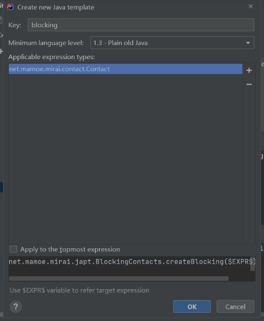

# mirai-japt

Mirai Java Apt  

提供阻塞API 来让 Java 调用 Mirai 的 API 更容易

## 开始

```java
class Test{
    public static void main(String[] args){
        BlockingBot bot = BlockingBot.newInstance(123456, "");
        
        bot.login();
        
        bot.getFriendList().forEach(friend -> {
            System.out.println(friend.getNick());
        });
        
        Events.subscribeAlways(GroupMessage.class, (GroupMessage message) -> {
            final BlockingQQ sender = BlockingContacts.createBlocking(message.getSender());
        
            sender.sendMessage("Hello");
        });
        
        Thread.sleep(999999999);
    }
}
```

## 便捷开发

在 IntelliJ IDEA 或 Android Studio 中找到设置 `Editor -> General -> Postfix Completion`, 添加一个设置到 `Java` 分类中:  
  
Applicable expression types:
```
net.mamoe.mirai.contact.Contact
```
转换后表达式:
```
net.mamoe.mirai.japt.BlockingContacts.createBlocking($EXPR$)
```

效果:


